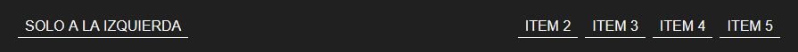

# Menus de navegación con Flexbox

[live](https://rr69sport.github.io/flexbox-navs/)

## css

```css
.menu {
    display: flex;
}
.to-left {
    margin-right: auto;
}
.to-right {
    margin-left: auto;
}
.centered {
    margin-right: auto;
    margin-left: auto;
}
```

## html



```html
    <!-- Un elemento a la izquierda -->
    <nav class="main-nav">
        <ul class="menu">
            <!-- Empuja el resto de los items de menú hacia la derecha -->
            <li class="menu__item to-left">
                <a class="menu__link" href="#">Solo a la izquierda</a>
            </li>
            <li class="menu__item">
                <a class="menu__link" href="#">Item 2</a>
            </li>
            <li class="menu__item">
                <a class="menu__link" href="#">Item 3</a>
            </li>
            <li class="menu__item">
                <a class="menu__link" href="#">Item 4</a>
            </li>
            <li class="menu__item">
                <a class="menu__link" href="#">Item 5</a>
            </li>
        </ul>
    </nav>
```


```html
    <!-- Un elemento al centro -->
    <nav class="main-nav">
        <ul class="menu">
            <li class="menu__item">
                <a class="menu__link" href="#">Item 1</a>
            </li>
            <li class="menu__item">
                <a class="menu__link" href="#">Item 2</a>
            </li>
            <!-- Empuja los elementos a los lados quedando centrado -->
            <li class="menu__item centered">
                <a class="menu__link" href="#">Centrado</a>
            </li>
            <li class="menu__item">
                <a class="menu__link" href="#">Item 4</a>
            </li>
            <li class="menu__item">
                <a class="menu__link" href="#">Item 5</a>
            </li>
        </ul>
    </nav>
```


```html
    <!-- 3 elementos al centro -->
    <nav class="main-nav">
        <ul class="menu">
            <li class="menu__item to-left">
                <a class="menu__link" href="#">Solo a la izquierda</a>
            </li>
            <li class="menu__item">
                <a class="menu__link" href="#">Item 2</a>
            </li>
            <li class="menu__item">
                <a class="menu__link" href="#">Item 3</a>
            </li>
            <li class="menu__item">
                <a class="menu__link" href="#">Item 4</a>
            </li>
            <li class="menu__item to-right">
                <a class="menu__link" href="#">Solo a la derecha</a>
            </li>
        </ul>
    </nav>
```


```html
    <!-- Un elemento a la derecha -->
    <nav class="main-nav">
        <ul class="menu">
            <li class="menu__item">
                <a class="menu__link" href="#">Item 1</a>
            </li>
            <li class="menu__item">
                <a class="menu__link" href="#">Item 2</a>
            </li>
            <li class="menu__item">
                <a class="menu__link" href="#">Item 3</a>
            </li>
            <li class="menu__item">
                <a class="menu__link" href="#">Item 4</a>
            </li>
            <li class="menu__item to-right">
                <a class="menu__link" href="#">Solo a la derecha</a>
            </li>
        </ul>
    </nav>
```
